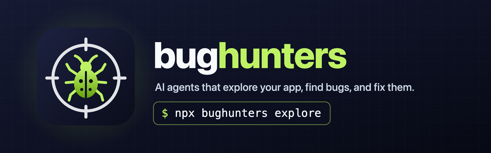

<p align="center">
  
</p>

<p align="center">
  <a href="https://www.npmjs.com/package/bughunters"></a>
  <a href="https://github.com/agent-labs-dev/bughunters/actions/workflows/ci.yml"></a>
  <a href="LICENSE"></a>
</p>

Bughunters is a QA team made of agents. It uses your app the way a tester does, finds bugs, fixes them, checks each fix in the running app, and opens the pull requests and issues for your team.

- An **explorer** agent runs the app, maps its screens, and reports what looks wrong.
- A **judge** agent decides which reports are real bugs, and writes the issues.
- A **fixer** agent writes a fix in its own git worktree. Then the explorer and the judge **retest** the fix in the running app.
- Bughunters **publishes** to GitHub: a PR for each fix, and an issue for each major bug with no fix.

It works on web apps, desktop apps (Electron), and mobile apps (iOS and Android, native or React Native). It runs on your machine, and it can run all day as a patrol.

The [Nebula](https://nebula.gg) team uses Bughunters every day to test our own web, desktop, and mobile apps. We made it open source, so that all teams can use it.

```bash
npx bughunters patrol
```

`patrol` runs the full cycle again and again: explore, judge, fix, retest, and publish. The fixer and GitHub stay off until you turn them on.

### How the patrol runs

- The patrol does not stop by itself. Every 30 minutes, it pulls the latest `origin/main`.
- The patrol runs a full cycle only when `main` has new commits. If the commit did not change, the patrol only syncs the state of GitHub issues and PRs, and waits again. So a patrol that runs all day costs little when nobody merges code.
- The first cycle of each `patrol` run always runs, also with no new commit.
- You can change the wait with `agents.patrol.intervalMinutes`. To stop after a number of cycles, set `agents.patrol.cycles`. To run one cycle only, use `patrol --once`.
- To use a different branch, set `agents.patrol.pull`.
- Let the patrol run all the time on a dedicated computer or a cloud VM. The patrol changes the checkout of the repo, so do not run it in the checkout where you work.

When you turn on GitHub, the patrol opens GitHub issues and PRs automatically, in each cycle, with no approval step. It opens a PR for each fix, and an issue for each major bug with no fix. The PRs are drafts by default (`agents.github.pullRequests`). You can close any issue or PR: the patrol learns from it, and it does not open it again. [GitHub](docs/github.md) tells more.

## Set up with your agent

1. Install the Bughunters skill in your repo:

   ```bash
   npx skills add agent-labs-dev/bughunters
   ```

   The [skills CLI](https://github.com/vercel-labs/skills) installs the skill for Claude Code, Codex, Cursor, and many other agents. It also writes `skills-lock.json` at the repo root. Commit both, so your team gets the skill too.

2. Give this prompt to your agent:

   ```text
   Set up Bughunters for this repo.
   ```

The [skill](skills/bughunters/SKILL.md) tells the agent what Bughunters does, how to configure it for your app, how to run it, and how to show you the results.

If your agent cannot install skills, give it the skill URL:

```text
Read https://raw.githubusercontent.com/agent-labs-dev/bughunters/main/skills/bughunters/SKILL.md and set up Bughunters for this repo.
```

## Set up by hand

Bughunters needs two things from you: a command that launches your app on this machine, and a way to sign in (a test account, a seed script, or a dev auth bypass). [Getting started](docs/getting-started.md#before-you-start-launch-and-sign-in) tells more.

You need Node 22 or later, and `git`. Your app must be in a git repo with an `origin` remote, because each patrol cycle pulls `origin/main` and the fixer works in git worktrees. To open PRs and issues, you also need a logged-in [`gh`](https://cli.github.com) CLI.

For a web app, install Chromium for Playwright one time:

```bash
PLAYWRIGHT_SKIP_BROWSER_GC=1 npx -y playwright@1.48.2 install chromium
```

1. Run `init` in your repo. It finds your app and the LLMs on your machine, and asks which LLM each agent uses:

   ```bash
   npx bughunters init
   ```

   `init` puts all the Bughunters files in one `.bughunters/` folder:

   ```text
   .bughunters/
     bughunters.yml     # the config: commit it
     instructions.md    # the app guide for the explorer: commit it
     runs/              # sessions, issues, fixes, and screenshots: git ignores it
   ```

2. Check `.bughunters/bughunters.yml`. It tells Bughunters how to start your app.

3. Write `.bughunters/instructions.md`. It is a plain-English note for the explorer: what the app is, how to sign in, and what never to do.
   Refer to secrets as `{{NAME}}`, and list their names in `app.secrets`. Bughunters never sends the real values to a model.

4. Start the patrol, and look at the results:

   ```bash
   npx bughunters patrol        # explore, judge, fix, retest, publish; then check for new commits every 30 minutes
   npx bughunters dashboard     # http://127.0.0.1:4311
   ```

To run one step at a time, use these commands:

```bash
npx bughunters patrol --once  # one full cycle, then stop
npx bughunters explore        # the explorer maps the app and reports problems
npx bughunters judge          # the judge files the real bugs as issues
npx bughunters fix            # fix the worst issues, then retest each fix in the app
npx bughunters publish        # open the PRs and issues
```

The fixer and GitHub are off until you turn them on. [Getting started](docs/getting-started.md) shows each step in full, with Electron and mobile examples.

## LLMs and Jev

Bughunters uses LLM agents for the work that needs reasoning, and Jev for the fast, repeated triage. This split lets it run all day on your app at a low cost.

| Part | Model | What it does |
| --- | --- | --- |
| Explorer | LLM | Uses the app, maps its screens, and reports what looks wrong |
| Judge | LLM | Decides which findings are real bugs, writes the issues, and checks each fix |
| Fixer | LLM | Writes a fix in its own git worktree |
| Decider | [Jev](https://typesafe.ai) | Screens each finding from the automatic checks in one fast, low-cost call, so the judge gets only the findings that need it |

Each agent can use a different LLM:

- A local agent CLI, with your existing login: [Claude Code](https://claude.com/claude-code), [Codex](https://github.com/openai/codex), [Kimi CLI](https://github.com/MoonshotAI/kimi-cli), or [pi](https://github.com/badlogic/pi-mono).
- An API key: OpenRouter, Vercel AI Gateway, OpenAI, Anthropic, or a custom endpoint.

Give the judge your strongest model, and give the explorer a fast, low-cost model. We recommend these models:

| Agent | What it needs | Anthropic | OpenAI | Other labs (OpenRouter) |
| --- | --- | --- | --- | --- |
| Explorer | Vision, computer use, reliable tool calls, low cost | Claude Sonnet 5 | GPT-6 Luna | Gemini 3.8 Flash |
| Judge | Precision, fine visual detail, clear writing | Claude Opus 5.5 | GPT-6 Sol | Kimi K3 |
| Fixer | Strong coding, in an agent CLI | Claude Code with Claude Opus 5.5 | Codex with GPT-6 Astra | Kimi CLI with Kimi K3 |

[Which model for each agent](docs/models.md#which-model-for-each-agent) gives the `use:` config for each model.

Jev needs a TypeSafe, OpenRouter, or Vercel AI Gateway key. We recommend a Jev key: without it, a general model or the judge does the triage, at a higher cost. [LLMs and Jev](docs/models.md) tells more, and shows how to configure each agent.

## What is supported

| Area | Supported |
| --- | --- |
| Platforms | Web (Playwright), Electron (CDP), iOS simulator and Android emulator (Maestro) |
| Login | Any auth system: your own setup commands plus plain-English instructions |
| Agent LLMs | Claude Code, Codex, Kimi CLI, pi, or any CLI agent; or an API key for OpenRouter, Vercel AI Gateway, OpenAI, Anthropic, or a custom endpoint |
| Triage | Jev, through TypeSafe, OpenRouter, or Vercel AI Gateway |
| GitHub | PRs, issues, and state sync through the `gh` CLI |
| Output | A local dashboard, GitHub PRs and issues, and JSON files under `.bughunters/runs/` |

## Documentation

| Page | What it covers |
| --- | --- |
| [Getting started](docs/getting-started.md) | Add Bughunters to your repo, step by step |
| [LLMs and Jev](docs/models.md) | What each model does, and the providers for each agent |
| [Configuration](docs/configuration.md) | All the settings in `.bughunters/bughunters.yml` |
| [Commands](docs/commands.md) | All the CLI commands |
| [GitHub](docs/github.md) | Set up the PRs and issues, look at the reports first, and sync the state back |
| [The dashboard](docs/dashboard.md) | What each page shows, and the files behind it |
| [How it works](docs/how-it-works.md) | The cycle, noise control, memory, GitHub, and safety |
| [The deterministic gate](docs/deterministic-gate.md) | `bughunters run`: a merge gate for web apps that uses no agent |
| [Development](docs/development.md) | Build Bughunters from source, the packages, and the examples |

## License

[Apache-2.0](LICENSE)

---

<p align="center">Made with ❤️ by the <a href="https://nebula.gg">Nebula</a> team.</p>
