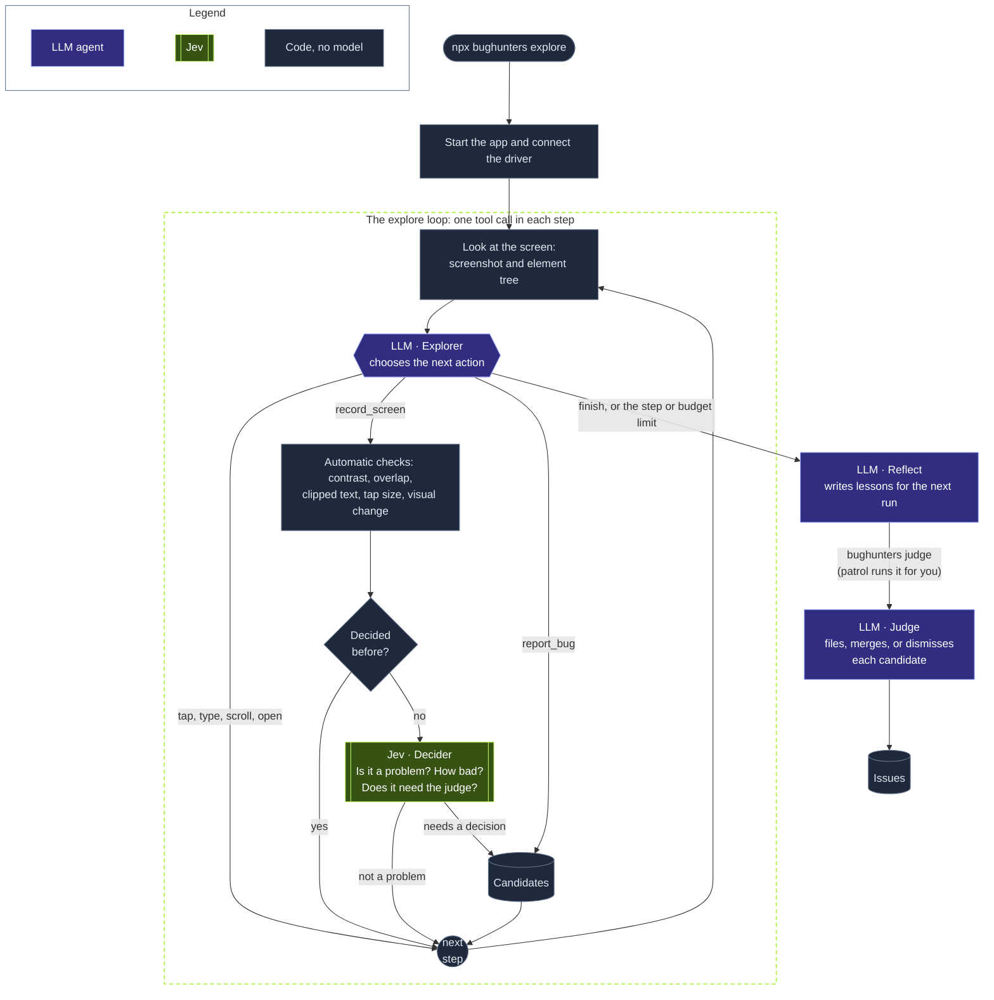

# How it works

## The agents

- An **explorer** agent runs the app, maps its screens, and reports what looks wrong.
- A **decider** (Jev) makes the fast calls: is this finding real, and how bad is it.
- A **judge** agent decides what the decider cannot, and writes the issues.
- A **fixer** agent writes a fix in its own git worktree.
- The explorer and the judge then **retest** the fix in the running app, with before and after screenshots.
- The judge **publishes** to GitHub: a PR for each fix, and an issue for each major bug with no fix.

## The cycle

A patrol cycle has these steps:

1. **Pull** fetches `origin/main` and checks out its latest commit in the source repository, so each cycle tests the latest code. The checkout is a detached `HEAD`: your local `main` does not change, and the pull works in a linked worktree. Set `agents.patrol.pull` to use a different branch, or to `false` to keep the checkout as it is. If the checkout has uncommitted changes, the cycle uses the current checkout. If the commit is the same as in the last full cycle, the patrol skips the other steps, and only syncs GitHub.
2. **Setup** runs your commands and connects the driver to the app.
3. The **explorer** enters the app (with the `enter-app` routine when it can), records screens, and reports problems. Automatic checks (contrast, overlap, tap size, visual change) run on each screen that it records.
4. The **decider** routes each finding: drop it, or send it to the judge.
5. The **judge** looks at each finding with its screenshot. It files an issue, adds the finding to an issue that is already open, or dismisses it with a reason.
6. **Teardown** stops the app.
7. The **fixer** fixes the worst issues. Each fix gets a **retest**: Bughunters starts the app from the fix worktree, the explorer repeats the flow on each affected screen, and the judge compares before and after.
8. The judge **publishes**. A fix becomes a PR. A major bug with no fix becomes an issue.

## The explore loop

The explorer uses the app one step at a time. In each step, it looks at the screen and calls one tool. When it records a screen, the automatic checks run on that screen. Jev screens each new finding, and the judge gets only the findings that need a decision.

## Noise control

Bughunters keeps the list of issues short:

- One rule on one screen gives one finding, not one finding for each element.
- Each finding has a fingerprint. A finding that the judge filed or dismissed before does not go to the judge again. A filed finding adds one more occurrence to its issue.
- The judge looks for one shared cause first, so ten screens that fail in the same way become one issue.
- A dismissed issue does not come back. A fixed issue that comes back reopens as a regression.
- An issue from the automatic checks closes by itself after 3 visits with no finding. A merged fix gets a recheck on the main branch.

## Memory

After each explorer session, Bughunters reads what went wrong: failed taps, retyped fields, broken routines. Then it writes short lessons to `.bughunters/runs/memory.json`. Human dismissals, fixer declines, rejected PRs, and commit hook errors also become lessons. Each role gets its lessons in its prompt, so the next run does not repeat the same mistakes.

## GitHub

The judge writes a short summary. Bughunters adds the full report: the steps, the screenshots, the fix, and the before and after table. It uploads the images to the orphan `bughunters-assets` branch, so the images never enter the PR diff. PR titles use the Conventional Commits form, for example `fix(app): expand the sidebar in a narrow window`. When the team closes a PR without a merge, Bughunters does not propose that change again. Bughunters never force-pushes and never uses `--no-verify`.

## Safety

- The fixer works only in its own worktree.
- A human decision (a dismissal, a closed PR) is never overwritten.
- Secrets never reach a model or a log.
- `app.instructions` can list what the explorer must never do.

The full design is in [ADR 0005](adr/0005-agents-drivers-and-the-patrol.md).
